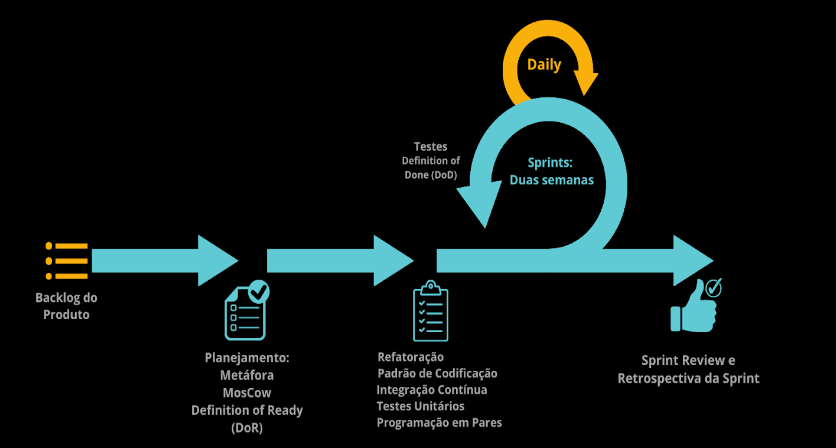

# Processo de desenvolvimento de software

Ao desenvolver uma aplicação, é importante ter em mente que o sucesso do projeto depende não só do código escrito, mas também da forma como ele é gerenciado e desenvolvido. Para isso utilizaremos duas metodologias durante o desenvolvimento da nossa aplicação: Scrum e XP.  Ao utilizar o Scrum e o XP juntos, é possível obter benefícios como um processo ágil de desenvolvimento bem definido, entregas frequentes e maior qualidade do código. Além disso, a comunicação contínua entre a equipe de desenvolvimento e o cliente permite que as necessidades do cliente sejam atendidas de forma mais eficiente. Assim, como ferramenta de comunicação, utilizaremos a plataforma Teams.

## SCRUM
- Product Backlog: A equipe, com o apoio do Product Owner, irá elaborar o backlog do produto, analisando prioridades e necessidades para o produto e equipe durante conversas conjuntas.
- Sprint Planning: Durante essa reunião, a equipe irá decidir o Sprint Backlog, horários e formatos das dailys da sprint em questão. A metodologia escolhida e que será adotada para as reuniões de sprint planning é a metodologia MoSCoW. Essa metodologia consiste em dividir as histórias de usuário em quatro categorias: Must Have (precisa ter), Should Have (deveria ter), Could Have (poderia ter) e Won't Have (não terá). Essa divisão é feita com base na importância e prioridade.
- Duração das Sprints:  Cada sprint terá a duração de 2 semanas.
- Daily: As dailys ocorrerão diariamente e serão realizadas através da plataforma Teams. Em cada daily, cada membro irá relatar o desenvolvimento das suas atividades e se houveram dificuldades ou impedimentos. 
- Sprint Review: Durante a Sprint Review, faremos a revisão dos resultados da Sprint, a validação do que foi implementado, o alinhamento de expectativas e atualização do Product Backlog com a presença do cliente.
- Sprint Retrospective: Essa reunião ocorrerá ao fim de cada sprint e terá como objetivo analisar a dinâmica de trabalho da equipe e das ferramentas utilizadas, procurando melhorar se algo deixar a desejar.

## XP(Extreme Programming)
- Refatoração: Refatorar o código constantemente contribui para a legibilidade e facilitação do entendimento, tanto pela parte de quem escreveu, tanto pela parte de quem vai corrigir ou fazer a sua manutenção.
- Metáfora: Explicar o projeto de forma simples auxilia o time e o cliente a entender os elementos do sistema.
- Padrões de codificação: Uma codificação padronizada facilita a comunicação, encoraja a posse coletiva e evita problemas na programação.
- Integração contínua: A Integração contínua aumenta o feedback da equipe quanto ao projeto como um todo, de modo que todos estarão constantemente atualizados quanto a situação atual do projeto. Além disso, o descobrimento de problemas com a integração é feito muito mais cedo.
- Programação em pares: É uma abordagem colaborativa em que dois desenvolvedores trabalham juntos em um único código, compartilhando conhecimentos e habilidades para melhorar a qualidade e eficiência do desenvolvimento de software.
- Teste unitário: Testes que verificam se uma parte do código, a nível de função, se está funcionando corretamente.

